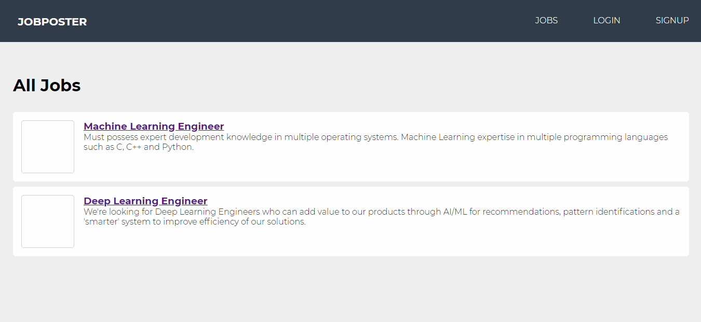

# Adonis Job Poster Application

A simple job posting application in AdonisJS

### Demo

### Tutorial Reference
https://coursetro.com/posts/code/170/Adonis-4-Tutorial---Learn-Adonis-4-in-this-Crash-Course

## How to run

- Run `npm install` to install all dependencies
- Make a copy of `.env.example` rename it to `.env`
- Run `adonis key:generate` to generate the secret key
- Run `adonis migration:run` to setup the database
- Run `adonis serve --dev` to run the application
